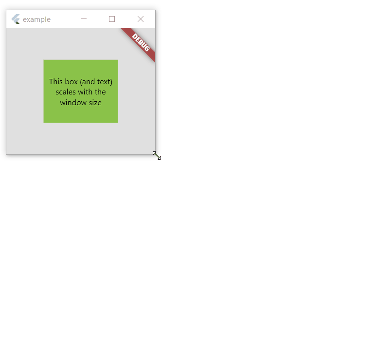

# Responsive Units
Responsive Units is a simple flutter package that aims to aide with the development of responsive
apps by providing responsive units that scale with the device's screen size.

While a number of other implementations on pub exist to tackle this particular issue, I found them to not work well on desktop and therefore decided to create a new one.



## Installation
Add Responsive Units as a dependency in your pubspec.yaml
```yaml
dependencies:
  ...
  responsive_units: ^0.1.0
```
## Supported units
- ```.w``` Returns width in pixels calculated as a percentage of the screen's width. (ex: 50.w return 50% of the screen's width)
- ```.h``` Returns height in pixels calculated as a percentage of the screen's height. (ex: 50.h return 50% of the screen's height)
- ```.dg``` Returns diagonal length in pixels calculated as a percentage of the screen's diagonal. (ex: 50.dg return 50% of the screen's diagonal)

## Usage
To start using the responsive units, simply add the following builder argument to your WidgetsApp
```dart
MaterialApp(
  ...
  builder: (context, child) => AppSizer(
    child: child,
  ),
  ...
)
```
Now you can use the responsive units anywhere in your source code by just importing the package
```dart
import 'package:responsive_units/responsive_units.dart';
```

## Minimal Example
```dart
import 'package:flutter/material.dart';
import 'package:responsive_units/responsive_units.dart';

void main() {
  runApp(const MyApp());
}

class MyApp extends StatelessWidget {
  const MyApp({Key? key}) : super(key: key);

  @override
  Widget build(BuildContext context) {
    return MaterialApp(
      builder: (context, child) => AppSizer(
        child: child,
      ),
      home: const ResponsiveBox(),
    );
  }
}

class ResponsiveBox extends StatelessWidget {
  const ResponsiveBox({Key? key}) : super(key: key);

  @override
  Widget build(BuildContext context) {
    return Container(
      color: Colors.grey.shade300,
      child: Center(
        child: Container(
          width: 50.w,
          height: 50.h,
          color: Colors.lightGreen,
          child: Center(
            child: Text(
              "This box (and text) scales with the window size",
              style: Theme.of(context)
                  .textTheme
                  .headline4
                  ?.copyWith(fontSize: 4.dg, color: Colors.black),
              textAlign: TextAlign.center,
            ),
          ),
        ),
      ),
    );
  }
}
```

## Feedback
If you have any feedback you'd like to share or issues with the package, feel free to submit a new issue at https://github.com/peter-sidra/responsive_units/issues