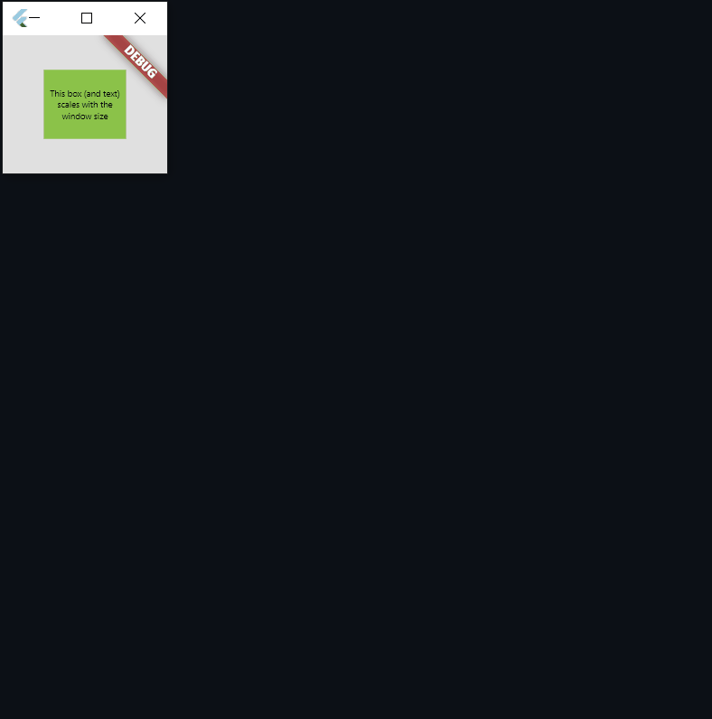

# Responsive Units

Responsive Units is a simple flutter package that aims to aide with the development of responsive
apps by providing responsive units that scale with the device's screen size.

While a number of other implementations on pub exist to tackle this particular issue, I found them to not work well on desktop and therefore decided to create a new one.



## Installation

Add Responsive Units as a dependency in your pubspec.yaml

```yaml
dependencies:
  ...
  responsive_units: ^0.2.0
```

## Supported units

| Unit    | Description |
| ------- | --------- |
| `.w`    | Width in pixels calculated as a percentage of the screen's width. (ex: `50.w` return 50% of the screen's width) |
| `.h`    | Height in pixels calculated as a percentage of the screen's height. (ex: `50.h` return 50% of the screen's height) |
| `.dg`   | Diagonal length in pixels calculated as a percentage of the screen's diagonal. (ex: `50.dg` return 50% of the screen's diagonal) |
| `.sfw`  | The (safe) width in pixels calculated as a percentage of the screen's width excluding the parts of the display that are partially obscured by system UI (such as notches and the status bar) ex: `50.sfw` returns 50% of the screen's safe width |
| `.sfh`  | The (safe) height in pixels calculated as a percentage of the screen's height excluding the parts of the display that are partially obscured by system UI (such as notches and the status bar) ex: `50.sfh` returns 50% of the screen's safe height |
| `.sfdg` | The (safe) diagonal length in pixels calculated as a percentage of the screen's diagonal length excluding the parts of the display that are partially obscured by system UI (such as notches and the status bar) ex: `50.sfdg` returns 50% of the screen's safe diagonal |
| `.sp`   | Returns a scalable pixel value that scales with the user selected text scale factor <br> Tip: chain .sp to any other unit to scale with the text factor (ex: ```5.dg.sp``` will scale with both the diagonal and the text scale factor)|

## Usage

To start using the responsive units, simply add the following builder argument to your WidgetsApp

```dart
MaterialApp(
  ...
  builder: (context, child) => AppSizer(
    child: child,
  ),
  ...
)
```

Now you can use the responsive units anywhere in your source code by just importing the package

```dart
import 'package:responsive_units/responsive_units.dart';
```

## Minimal Example

```dart
import 'package:flutter/material.dart';
import 'package:responsive_units/responsive_units.dart';

void main() {
  runApp(const MyApp());
}

class MyApp extends StatelessWidget {
  const MyApp({Key? key}) : super(key: key);

  @override
  Widget build(BuildContext context) {
    return MaterialApp(
      builder: (context, child) => AppSizer(
        child: child,
      ),
      home: const ResponsiveBox(),
    );
  }
}

class ResponsiveBox extends StatelessWidget {
  const ResponsiveBox({Key? key}) : super(key: key);

  @override
  Widget build(BuildContext context) {
    return Container(
      color: Colors.grey.shade300,
      child: Center(
        child: Container(
          width: 50.w,
          height: 50.h,
          color: Colors.lightGreen,
          child: Center(
            child: Text(
              "This box (and text) scales with the window size",
              style: Theme.of(context)
                  .textTheme
                  .headline4
                  ?.copyWith(fontSize: 4.dg.sp, color: Colors.black),
              textAlign: TextAlign.center,
            ),
          ),
        ),
      ),
    );
  }
}
```

## Feedback

If you have any feedback you'd like to share or issues with the package, feel free to submit a new issue at https://github.com/peter-sidra/responsive_units/issues
